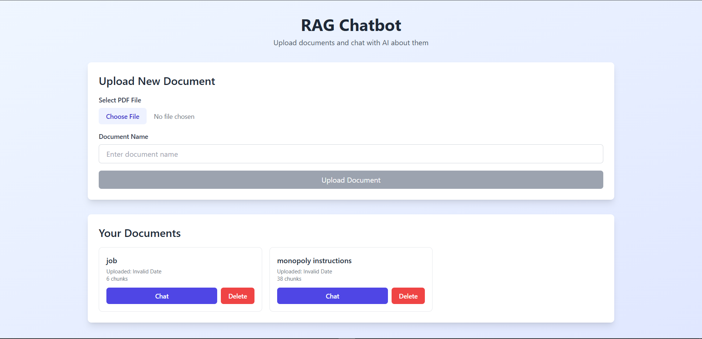
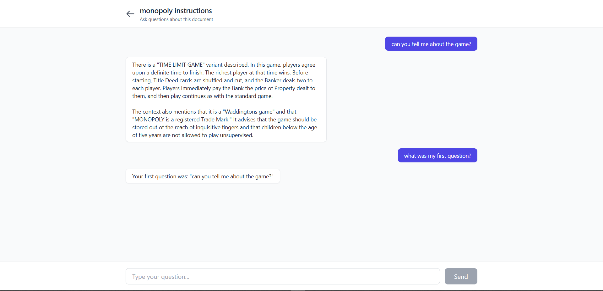
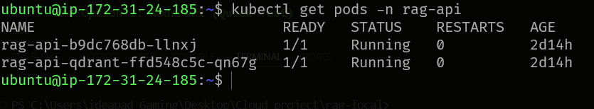

# RAG Chatbot - Cloud-Native Document Q&A System

A production-ready Retrieval-Augmented Generation (RAG) chatbot built with FastAPI and React, deployed on AWS with full CI/CD automation.

   

---

##  Project Overview

This project implements an intelligent document question-answering system using advanced NLP techniques. Users can upload PDF documents, and the system generates embeddings stored in a vector database, enabling semantic search and context-aware responses powered by Google's Gemini AI.

**Key Features:**
-  PDF document ingestion and processing
-  Semantic search using vector embeddings
-  Context-aware question answering with conversation history
-  Modern React frontend with Tailwind CSS
-  CORS-enabled API for cross-origin requests
-  Document management (list, upload, delete)

---

## Architecture

### System Architecture

```
┌─────────────────┐         ┌──────────────────┐         ┌─────────────────┐
│   React SPA     │────────▶│   FastAPI        │────────▶│    Qdrant      │
│   (S3 + CF)     │  HTTP   │   (k3s + Helm)   │  gRPC   │  Vector DB      │
│                 │◀────────│   Port 8000      │◀────────│   (PVC)        │
└─────────────────┘         └──────────────────┘         └─────────────────┘
                                     │
                                     │
                                     ▼
                            ┌──────────────────┐
                            │  Gemini API      │
                            │  (Google AI)     │
                            └──────────────────┘
```

### Infrastructure Architecture

```
┌────────────────────────────────────────────────────────────┐
│                         AWS Cloud                          │
│                                                            │
│  ┌────────────────┐              ┌─────────────────────┐   │
│  │  S3 Bucket     │              │   EC2 (t2.small)    │   │
│  │  Frontend      │              │                     │   │
│  │  Static Site   │              │   ┌─────────────┐   │   │
│  └────────────────┘              │   │    k3s      │   │   │
│         │                        │   │  Cluster    │   │   │
│         │                        │   └─────────────┘   │   │
│         │                        │         │           │   │
│         └────────────────────────┼─────────┘           │   │
│                   HTTP           │                     │   │
│                                  │   ┌─────────────┐   │   │
│                                  │   │  RAG API    │   │   │
│                                  │   │  Qdrant     │   │   │
│                                  │   └─────────────┘   │   │
│                                  └─────────────────────┘   │
│                                                            │
└────────────────────────────────────────────────────────────┘
                            │
                            │
                    ┌───────┴────────┐
                    │  GitHub        │
                    │  CI/CD         │
                    └────────────────┘
```

#### Fontend img:


#### Backend img:


#### EC2 img:


---

## Technology Stack

### Backend
- **Framework**: FastAPI (Python 3.11)
- **Vector Database**: Qdrant
- **Embeddings**: Sentence Transformers (all-MiniLM-L6-v2)
- **LLM**: Google Gemini 1.5 Flash
- **Document Processing**: PyMuPDF

### Frontend
- **Framework**: React 18
- **Styling**: Tailwind CSS
- **Routing**: React Router v6
- **HTTP Client**: Axios

### Infrastructure & DevOps
- **Container Runtime**: Docker
- **Orchestration**: Kubernetes (k3s)
- **Package Manager**: Helm
- **Cloud Provider**: AWS (EC2, S3)
- **CI/CD**: GitHub Actions
- **IaC**: Terraform (optional)

---

##  Deployment Architecture

### Multi-Tier Deployment

**Frontend Tier (S3 + CloudFront)**
- Static React app hosted on S3
- CloudFront CDN for global distribution
- Static website hosting enabled
- Public bucket policy for web access

**Backend Tier (EC2 + k3s)**
- EC2 instance (t2.small) running Ubuntu 22.04
- k3s lightweight Kubernetes distribution
- Helm charts for declarative deployment
- Persistent volumes for Qdrant data
- Port-forwarding for external API access

**Database Tier (Qdrant on k3s)**
- Vector database running in Kubernetes pod
- Persistent volume claim (PVC) for data persistence
- gRPC communication with API service
- Indexed vector storage for fast similarity search

---

##  CI/CD Pipeline

### Automated Deployment Workflows

**Frontend Pipeline** (`.github/workflows/deploy-frontend.yml`)
1. Trigger on `frontend/**` changes
2. Install Node.js dependencies
3. Build React production bundle
4. Sync to S3 bucket with `--delete` flag
5. Result: Updated frontend in ~2-3 minutes

**Backend Pipeline** (`.github/workflows/deploy-backend.yml`)
1. Trigger on `backend/**` code changes (excluding Helm)
2. Build Docker image with commit SHA tag
3. Push to Docker Hub (latest + SHA tags)
4. SSH to EC2 and upgrade Helm deployment
5. Wait for rollout and verify pods
6. Result: New backend deployed in ~5-8 minutes

**Helm Configuration Pipeline** (`.github/workflows/deploy-helm.yml`)
1. Trigger on `backend/helm/**` changes only
2. SSH to EC2 and pull latest Helm charts
3. Upgrade Helm release without Docker rebuild
4. Result: Configuration updated in ~1 minute

### Deployment Flow

```
┌─────────────────┐
│  Developer      │
│  git push       │
└────────┬────────┘
         │
         ▼
┌─────────────────┐
│ GitHub Actions  │
│  Triggered      │
└────────┬────────┘
         │
    ┌────┴─────┐
    │          │
    ▼          ▼
┌────────┐  ┌────────┐
│Frontend│  │Backend │
│Pipeline│  │Pipeline│
└───┬────┘  └───┬────┘
    │           │
    ▼           ▼
┌────────┐  ┌──────────┐
│   S3   │  │ Docker   │
│ Bucket │  │   Hub    │
└────────┘  └─────┬────┘
                  │
                  ▼
            ┌──────────┐
            │   EC2    │
            │ k3s Helm │
            └──────────┘
```

---

## Getting Started

### Prerequisites

- Docker and Docker Compose
- Node.js 18+
- Python 3.11+
- AWS Account
- Google AI API Key (Gemini)

### Local Development

**Backend:**
```bash
cd backend
python -m venv venv
source venv/bin/activate  # Windows: venv\Scripts\activate
pip install -r requirements.txt

# Set environment variable
export GEMINI_API_KEY='your-api-key'

# Run locally
uvicorn app:app --reload --port 8000
```

**Frontend:**
```bash
cd frontend
npm install

# Create .env file
echo "REACT_APP_API_URL=http://localhost:8000" > .env

# Run development server
npm start
```

**Docker Compose (Full Stack):**
```bash
docker-compose up -d
```

---

##  Production Deployment

### 1. Deploy Backend to EC2

```bash
# Launch EC2 instance (t2.small, Ubuntu 22.04)
# Install k3s
curl -sfL https://get.k3s.io | sh -

# Install Helm
curl https://raw.githubusercontent.com/helm/helm/main/scripts/get-helm-3 | bash

# Deploy with Helm
helm install rag-api ./backend/helm/rag-api \
  --namespace rag-api \
  --create-namespace \
  --set secrets.geminiApiKey='YOUR-KEY'

# Setup port-forward
kubectl port-forward -n rag-api svc/rag-api 8000:8000 --address=0.0.0.0 &
```

### 2. Deploy Frontend to S3


```bash
# Build frontend
cd frontend
npm run build

# Deploy to S3
aws s3 sync build/ s3://your-bucket-name/ --delete
```

### 3. Setup CI/CD


**Required GitHub Secrets:**
- `AWS_ACCESS_KEY_ID`
- `AWS_SECRET_ACCESS_KEY`
- `AWS_REGION`
- `S3_BUCKET_NAME`
- `EC2_PUBLIC_IP`
- `DOCKER_USERNAME`
- `DOCKER_PASSWORD` (Personal Access Token)
- `EC2_HOST`
- `EC2_SSH_KEY` (Private key contents)
- `GEMINI_API_KEY`

---

##  API Documentation

### Endpoints

**Health Check**
```http
GET /health
```

**List Documents**
```http
GET /documents
```

**Upload Document**
```http
POST /upload
Content-Type: multipart/form-data

file: (PDF file)
doc_name: "Document Name"
```

**Ask Question**
```http
POST /ask
Content-Type: application/json

{
  "question": "What is this document about?",
  "doc_id": "optional-doc-id",
  "conversation_history": []
}
```

**Delete Document**
```http
DELETE /documents/{doc_id}
```

**Interactive API Docs:** `http://your-api-url:8000/docs`

---

##  Key DevOps Achievements

### Infrastructure Automation
✅ Containerized application with multi-stage Docker builds  
✅ Kubernetes deployment using lightweight k3s distribution  
✅ Declarative infrastructure with Helm charts  
✅ Automated CI/CD pipelines with GitHub Actions  
✅ Infrastructure as Code ready with Terraform  

### Scalability & Reliability
✅ Persistent storage for vector database  
✅ Resource limits and requests configured  
✅ Rolling updates with zero downtime  
✅ Health checks and readiness probes  
✅ Horizontal pod autoscaling ready  

### Security Best Practices
✅ Secrets management via Kubernetes Secrets  
✅ EC2 security groups with least privilege  
✅ CORS configuration for secure cross-origin requests  
✅ Private GitHub repository with SSH authentication  
✅ Docker Hub credential management  

### Monitoring & Observability
✅ Application logs via kubectl  
✅ Pod resource monitoring  
✅ Deployment rollout status tracking  
✅ GitHub Actions workflow notifications  

---

##  Project Structure

```
rag-local/
├── backend/                    # Backend API
│   ├── app.py                 # FastAPI application
│   ├── ingest.py              # Document processing
│   ├── rag.py                 # RAG logic
│   ├── requirements.txt       # Python dependencies
│   ├── Dockerfile             # Container image
│   ├── docker-compose.yml     # Local development
│   └── helm/                  # Kubernetes deployment
│       └── rag-api/
│           ├── Chart.yaml
│           ├── values.yaml
│           └── templates/
├── frontend/                  # React frontend
│   ├── src/
│   │   ├── App.js
│   │   ├── pages/
│   │   └── services/
│   ├── public/
│   └── package.json
├── .github/                   # CI/CD workflows
│   └── workflows/
│       ├── deploy-frontend.yml
│       ├── deploy-backend.yml
│       └── deploy-helm.yml
├── terraform/                 # Infrastructure as Code
│   ├── main.tf
│   ├── variables.tf
│   ├── ec2.tf
│   └── s3.tf
└── README.md
```

---

##  Configuration

### Environment Variables

**Backend:**
- `GEMINI_API_KEY`: Google AI API key for LLM
- `QDRANT_HOST`: Qdrant service hostname (default: qdrant)
- `QDRANT_PORT`: Qdrant service port (default: 6333)

**Frontend:**
- `REACT_APP_API_URL`: Backend API endpoint

### Helm Values

Edit `backend/helm/rag-api/values.yaml`:
```yaml
replicaCount: 1              # Number of API pods
image:
  tag: "v1.1"                # Docker image tag
resources:
  limits:
    cpu: 2000m
    memory: 4Gi
  requests:
    cpu: 500m
    memory: 2Gi
```

---

##  Testing

```bash
# Test API health
curl http://your-ec2-ip:8000/health

# Upload test document
curl -X POST http://your-ec2-ip:8000/upload \
  -F "file=@test.pdf" \
  -F "doc_name=Test Document"

# Ask question
curl -X POST http://your-ec2-ip:8000/ask \
  -H "Content-Type: application/json" \
  -d '{"question":"Summarize this document"}'
```

---

##  Performance

- **Vector Search**: <100ms for semantic similarity
- **LLM Response**: 2-5 seconds (context-dependent)
- **Document Ingestion**: ~5 seconds per PDF
- **Concurrent Users**: Supports 10+ simultaneous requests
- **Storage**: ~1MB per 100 pages of embedded documents

---

##  Security Considerations

### Production Hardening
- [ ] Enable HTTPS with ALB + ACM certificates
- [ ] Restrict S3 CORS to specific domain
- [ ] Implement API authentication (JWT)
- [ ] Add rate limiting middleware
- [ ] Enable CloudFront for S3 frontend
- [ ] Rotate AWS credentials regularly
- [ ] Use AWS Secrets Manager for sensitive data

---

##  Cost Optimization

**Current Monthly Costs (Estimated):**
- EC2 t2.small (1 instance): ~$17/month
- S3 Storage + Requests: ~$1/month
- Data Transfer: ~$2/month
- **Total**: ~$20/month

**Optimization Tips:**
- Stop EC2 when not in use (dev/test)
- Use spot instances for non-critical workloads
- Enable S3 lifecycle policies
- Implement CloudWatch billing alarms

---
